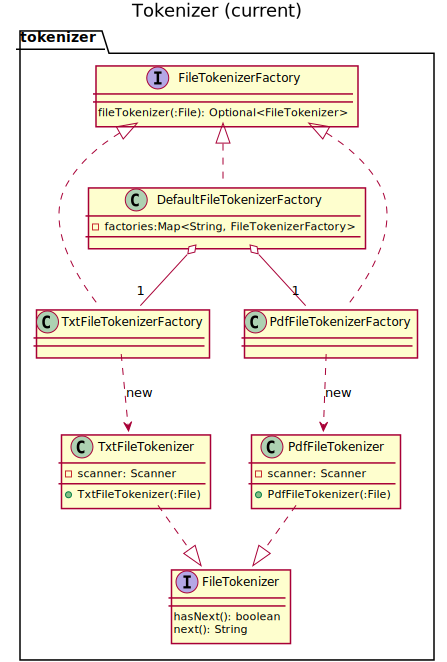

# Tarea corta #5 #

Curso IC-6821 Diseño de software  
Profesor Diego Munguía Molina

## Objetivos ##

* Aplicar el principio de abierto/cerrado en un ejercicio práctico

## Guía de trabajo ##

Continuamos el trabajo en la implementación de la aplicación de búsqueda en archivos de texto 
especificada en [STORIES.md](./STORIES.md).

Recordamos las responsabilidades identificadas:

1. Indexar un directorio  
    a. Recorrer la fuente de datos (directorio) archivo por archivo  
    b. Procesar archivo de texto recorriendo su contenido palabra por palabra  
    c. Asociar una palabra con la ruta absoluta al archivo en el índice  
    d. Reportar en pantalla cuál directorio está siendo procesado  
2. Buscar archivos por términos  
    a. Buscar archivos en el índice por un término específico  
    b. Consolidar resultados para cada término en un conjunto final  
    c. Reportar resultados en pantalla  

Para esta tarea corta nos vamos a concentrar en la responsabilidad 1.b. . Para resolver estas 
responsabilidades vamos a diseñar un módulo `tokenizer` que abstrae la funcionalidad de recorrer ("tokenizar") archivos
palabra por palabra.

Debemos resolver la siguiente tarea.

### Tarea 1 ###

El módulo `tokenizer` tiene dos interfaces `FileTokenizer` y `FileTokenizerFactory`. La interfaz `FileTokenizer` 
abstrae la funcionalidad de recorrer el contenido de un archivo palabra por palabra. Mientras que `FileTokenizerFactory`
tiene como responsabilidad crear los *tokenizadores* correspondientes a cada tipo de archivo.


El *factory* `DefaultFileTokenizerFactory` implementa un condicional para discriminar cuál tokenizador instanciar de acuerdo con la extensión del
archivo:

```java
final String extension = FilenameUtils.getExtension(file.getName());
if (FILE_EXT_PDF.equalsIgnoreCase(extension)) {
    return Optional.of(new PdfFileTokenizer(file));
} else if (FILE_EXT_TXT.equalsIgnoreCase(extension)) {
    return Optional.of(new TxtFileTokenizer(file));
} else {
    return Optional.empty();
}
```

Este diseño rompe el principio de abierto/cerrado, pues cuando soportemos un nuevo tipo de archivo tendremos que 
modificar este bloque de código para agregar la condición correspondiente.

Nuestra tarea es modificar el diseño actual para que la clase `DefaultFileTokenizerFactory` no rompa el principio de 
abierto/cerrado. El objetivo es no utilizar ningún tipo de estructura condicional en el método `fileTokenizer`.

Para cumplir con el principio de abierto/cerrado, modificaremos `DefaultFileTokenizer` para que contenga un mapeo entre
extensiones de archivo y *factories* para cada tipo correspondiente de *tokenizer*. 

De esta forma, cada vez que se 
invoque `fileTokenizer()` se seleccionara, con base en la extensión del archivo, el *factory* adecuado para crear la 
instancia del *tokenizer*.




## Aspectos operativos ##

- No modificar ningún archivo de código ya existente en el repositorio (excepto por `DefaultFileTokenizerFactory`).
- No modificar ninguna prueba automatizada.
- No modificar ningún chequeo de estilo. 
- No utilizar spanglish.
- Escribir código limpio.
- Las pruebas de código verifican todos los requerimientos funcionales.
- Como entrega se considera el último `push` de código al repositorio antes de la revisión del trabajo.
- Puede encontrar información sobre cómo corregir problemas identificados por los chequeos de estilo en el siguiente 
  enlace: https://checkstyle.sourceforge.io/checks.html 

## Rúbrica ##

#### Total 10 pts #### 

#### Entrega (2 pts) ####
- (2 pts) El historial del repositorio contiene commits significativos de la persona estudiante.
- (0 pts) El historial del repositorio no contiene commits significativos de la persona estudiante. Si no hay commits 
  significativos, el resto de criterios no serán aplicados.

#### Chequeo de estilo (2 pts) ####
- (2 pts) El código en el repositorio pasa todos los chequeos de estilo.
- (0 pts) El código en el repositorio no pasa todos los chequeos de estilo.

#### Chequeo de diseño (3 pts) ####
- (3 pts) El código en el repositorio pasa todos los chequeos de diseño.
- (1 pts) El código en el repositorio pasa la mayoría de los chequeos de diseño.
- (0 pts) El código en el repositorio no pasa los chequeos de diseño.

#### Pruebas de código (3 pts)
- (3 pts) El código en el repositorio pasa todas las pruebas de código.
- (1 pts) El código en el repositorio pasa la mayoría de las pruebas de código.
- (0 pts) El código en el repositorio no pasa las pruebas de código.

